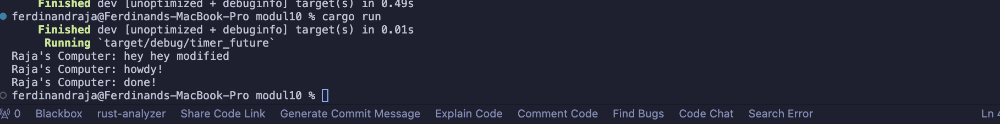

### Ferdinand Raja Kenedy 2206046683

## Experiment 1.2: Understanding how it works.

It resulted with the "hey hey modified" one comes first. This happens because the "hey hey modified" are located outside the asynchronous task. Therefore, when main runs, it runs the "hey hey modified" first, then the async task.