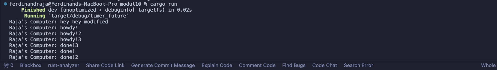
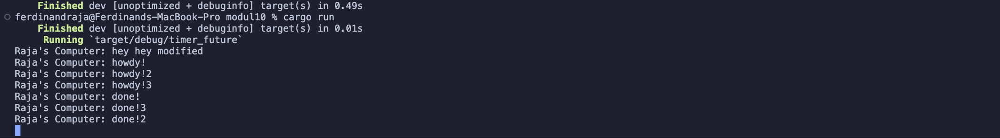

### Ferdinand Raja Kenedy 2206046683

## Experiment 1.2: Understanding how it works.

It resulted with the "hey hey modified" one comes first. This happens because the "hey hey modified" are located outside the asynchronous task. Therefore, when main runs, it runs the "hey hey modified" first, then the async task.

## Experiment 1.3: Multiple Spawn and removing drop
### With drop

### With drop removed

What happens if the drop spawn is removed is that the task will never stop on going. Therefore we can see that there's no sign that the operation is done, and it will keep going until there's a drop. On the other hand, with a drop spawn, we can see that the operation is done and exit to a normal terminal.